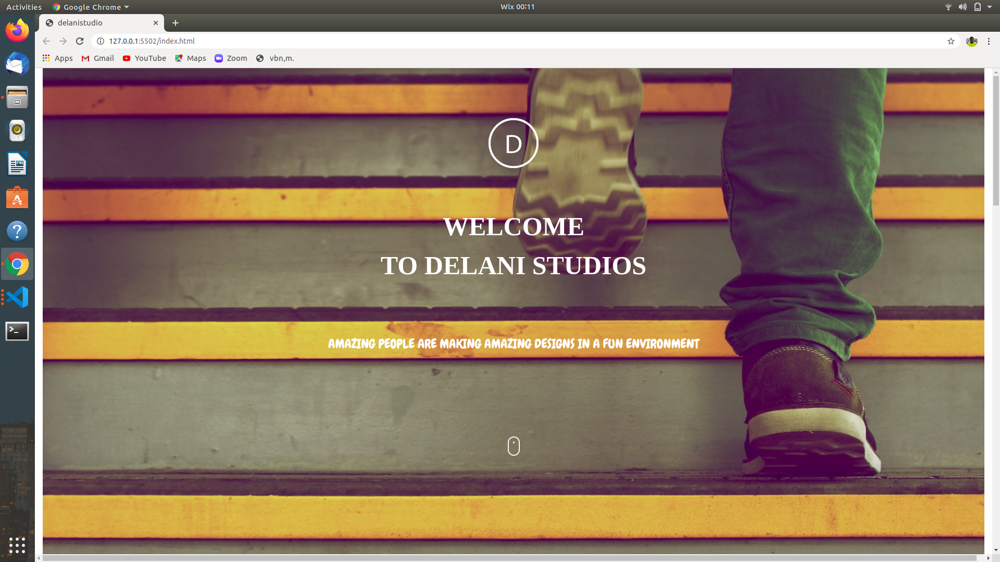

# DELANI STUDIO
This is a website on Delani studio

## DESCRIPTION 
This is a landing page for a fictional studio known as Delani studio.

### A SCREENSHOT OF THE PROJECT.

### TECNOLOGIES USED.
-HTML 5

-CSS

-Bootsrap

-JAVASCRIPT

-JQUERY

### AUTHOR

Wanzala Emmanuel John

###  SET UP INSTRUCTIONS
-To have a local copy of this project :

-git clone https://emmanuelwanzala.github.io/Delani-studio/

-cd into your desired project folder

-Depending on the text editor you are using,open the  project in your text editor via the terminal

### LIVE LINK

### LICENSE

MIT : https://spdx.org/licenses/MIT.html

